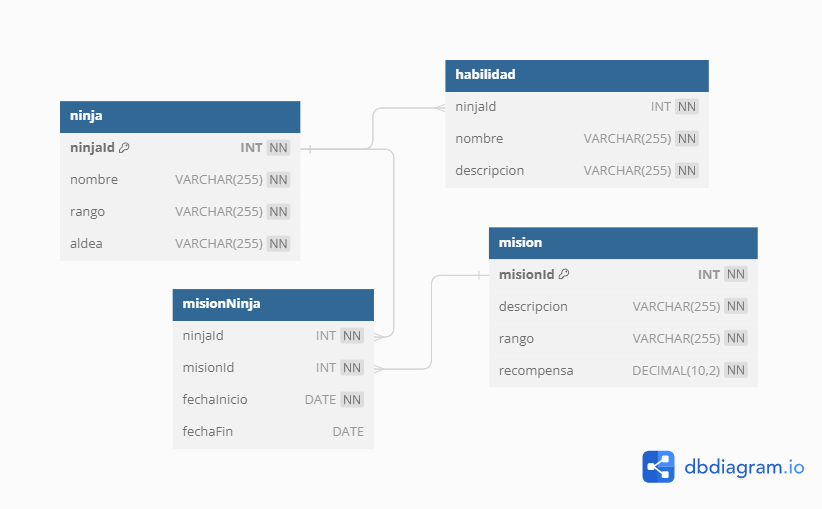
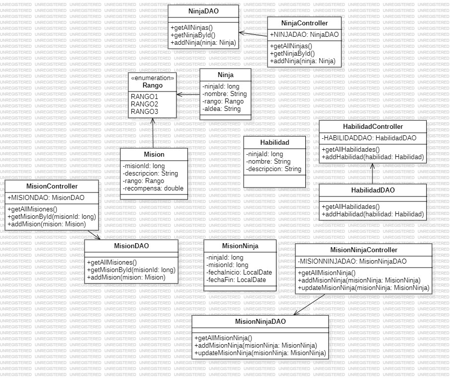

# Gestion de misiones 

Proyecto enfocado en la modernizacion de gestion de misiones y ninjas en la aldea, para el desarrollo del mismo y el buen funcionamiento se usaron:

- Lenguaje JAVA
- [JDBC](https://mvnrepository.com/artifact/com.mysql/mysql-connector-j)
- MySQL (Diagrama Base de Datos)
- StarUML (Diagrama de Clases)

## El sistema permite

- Registrar Ninjas
- Registrar Misiones
- Registrar Habilidades
- Completar las Misiones realizadas
- Guardar y Leer todas las Misiones Completadas en un archivo
- Listar todas las Misiones Completadas por Ninja
- Listar todas las Misiones Completadas en general

## Conclusiones

- Se completa el proyecto en su totalidad permitiendo realizar todos los requerimientos necesarios requeridos
- Se manejaron excepciones especificas para cada tipo de error.
- Se usaron Controladores que implementan el patron de diseño **Facade** para ocultar los procesos complejos ubicados en los archivos **DAO**.

## Diagrama BD



## Diagrama de clases



## Uso del Proyecto

Clona este repositorio en tu maquina local:

```BASH
git clone https://github.com/jstorra/filtroJava.git
```

---

<p align="center">Developed by <a href="https://github.com/jstorra">@jstorra</a></p>